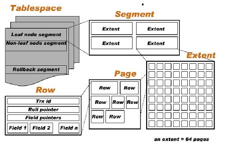

# innodb 介绍

## 1. 存储文件

```
1. 从物理意义上来讲，innodb表由共享表空间文件（ibdata1）、独占表空间文件（ibd）、表结构文件（.frm）、以及日志文件（redo文件等）组成

2. .frm文件是用来保存每个数据表的元数据(meta)信息，包括表结构的定义等， 用来在数据库崩溃时恢复表结构

3. 将innodb_file_per_table设置为on，则系统将为每一个表单独的生成一个table_name.ibd的文件，
   在此文件中，存储与该表相关的数据、索引、表的内部数据字典信息

4. 默认表空间文件是ibdata1，指定表数据和索引存储的空间，可以是一个或者多个文件。最后一个数据文件必须是自动扩充的，
   也只有最后一个文件允许自动扩充。这样，当空间用完后，自动扩充数据文件就会自动增长（以8MB为单位）以容纳额外的数据

5. 数据文件和事务日志文件分别存放于不同的物理磁盘上面以降低磁盘的相互争用，提高整体IO性能
```

## 2. 共享表空间

- 某一个数据库的所有的表数据，索引文件全部放在一个文件中，默认这个共享表空间的文件路径在 data 目录下。
- 多个表及索引在表空间中混合存储，这样对于一个表做了大量删除操作后表空间中将会有大量的空隙，并且线上无法收缩

## 3. 独占表空间

- 每一个表都将会生成以独立的文件方式来进行存储（.ibd 文件，这个文件包括了单独一个表的数据内容以及索引内容)。

## 4. 物理格式

### page

- innodb 存储引擎中的所有数据(表，索引)都是以 page 作为最小物理单位来存放的，默认 16k

### extent

- 由多个连续的 page 组成的一个物理存储单位。一般来说，每个 extent 为 64 个 page

### segment

- 每个 segment 由一个或多个 extent 组成，而且每个 segment 都存放同一种数据

### tablespace

- innodb 中最大物理结构单位了，由多个 segment 组成

### 结构图

- 

## 5. 参数说明

### innodb_data_file_path = ibdata1:900M;ibdata2:70M:autoextend;

- 定义系统表空间文件 ibdata1 的属性；

### innodb_data_home_dir = "/user/local/mysql/var"

- 数据库文件所存放的目录（表数据和索引文件）

### innodb_log_group_home_dir = "/user/local/mysql/var"

- 日志存放目录，日志文件 ib_logfile0/1 存放在哪个目录

### innodb_autoextend_increment = 128M

- 系统表空间文件每次扩展的大小

### innodb_file_per_table=1

- 是否使用共享还是独占表空间 (1:为使用独占表空间, 0:为使用共享表空间)
