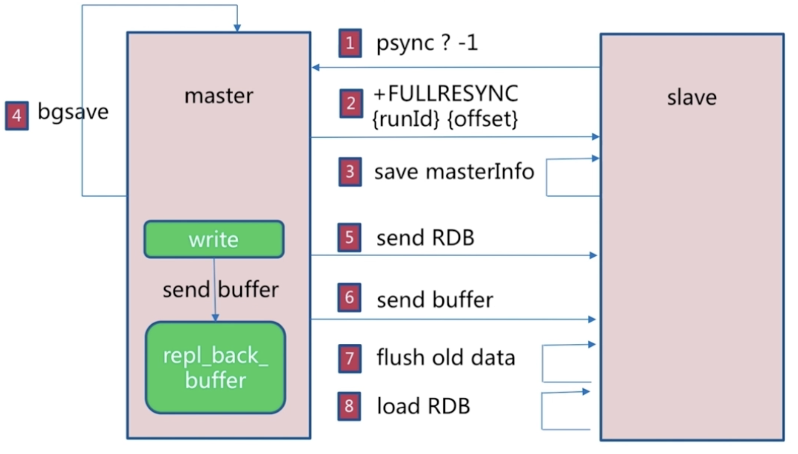
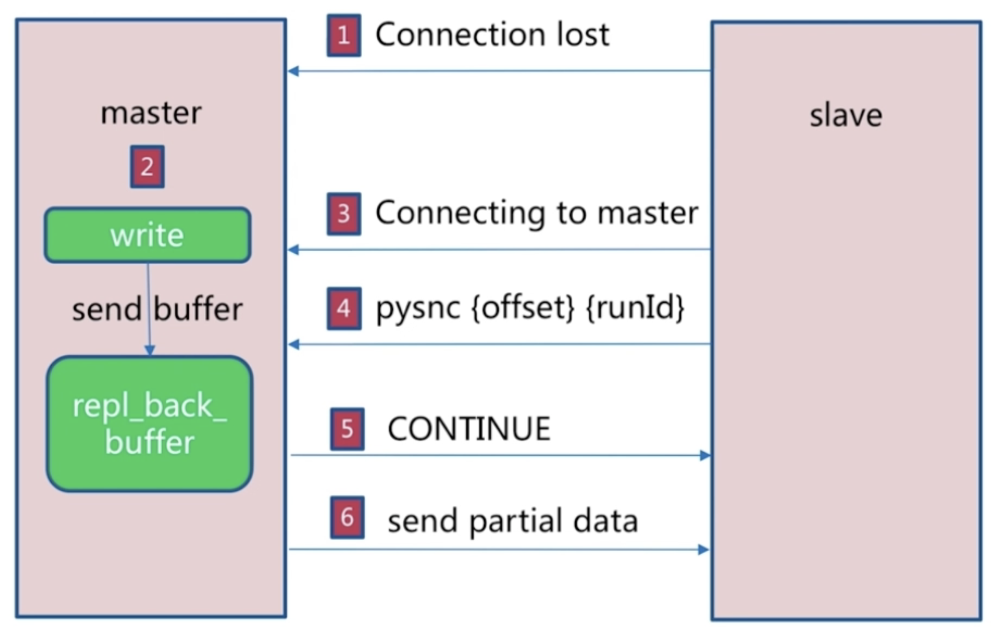

# redis 主从复制

## 1. 介绍

- 在 Redis 集群中，让若干个 Redis 服务器去复制另一个 Redis 服务器，我们定义被复制的服务器为主服务器（master），
  而对主服务器进行复制的服务器则被称为从服务器（slave），这种模式叫做主从复制模式
- 数据流向是单向的，只能是从 master 到 slave
- 一个 slave 只能有一个 master
- 一个 redis 可以即是主又是从

## 2. 作用

- 为数据提供多个副本，实现高可用
- 实现读写分离，主节点负责写数据，从节点负责读数据，主节点定期把数据同步到从节点保证数据的一致性

## 3. 复制流程

- slave node 启动，仅仅保存了 master node 的信息，包括 master node 的 host 和 ip，但是数据复制还没有开始
- master node 的 host 和 ip 是在 redis.conf 文件里面的 slaveOf 中配置的
- slave node 内部有一个定时任务，每秒检查是否有新的 master node 要连接个复制，如果发现，就跟 master node 建立 socket 网络连接
- slave node 发送 ping 命令给 master node
- 如果 master 设置了 requirepass，那么 slave node 必须发送 master auth 的口令过去进行口令验证
- master node 第一次执行全量复制，将所有数据发送给 slave node
- master node 持续降写命令，异步复制给 slave node

## 4. 主从复制的方式

### 方法 1，修改配置，需重启从服

- slaveof ip port
- slave-read-only yes
- 只允许从节点进行读操作

### 方法 2，命令行

- slaveof ip port
- 使用命令后自身数据会被清空，但取消 slave 只是停止复制，并不清空

## 5. 全量复制

- 用于初次复制或其它无法进行部分复制的情况
- 将主节点中的所有数据都发送给从节点，是一个非常重型的操作，当数据量较大时，会对主从节点和网络造成很大的开销
  

### 全量复制的过程

- 从服务器连接主服务器，发送 SYNC 命令
- 主服务器接收到 SYNC 命名后，开始执行 BGSAVE 命令生成 RDB 文件，并使用缓冲区记录此后执行的所有写命令
- 主服务器 BGSAVE 执行完后，向所有从服务器发送快照文件，并在发送期间继续记录被执行的写命令
- 主服务器快照发送完毕后，开始向从服务器发送缓冲区中的写命令
- 从服务器收到快照文件后，载入收到的快照，此时仍然使用旧数据提供服务，直到载入完成
- 从服务器完成对快照的载入，开始接收命令请求，并执行来自主服务器缓冲区的写命令

### 全量复制的开销

- 主节点需要 bgsave
- RDB 文件网络传输占用网络 io
- 从节点要清空数据
- 从节点加载 RDB
- 全量复制会触发从节点 AOF 重写

## 6. 部分复制

- 部分复制是 Redis 2.8 以后出现的，用于处理在主从复制中因网络闪断等原因造成的数据丢失场景，
  当从节点再次连上主节点后，如果条件允许，主节点会补发丢失数据给从节点。
- 因为补发的数据远远小于全量数据，可以有效避免全量复制的过高开销
- 需要注意的是，如果网络中断时间过长，造成主节点没有能够完整地保存中断期间执行的写命令，
  则无法进行部分复制，仍使用全量复制
  

### 部分复制过程

- 如果网络抖动，连接断开，connection lost
- 主机 master 还是会写 repl_back_buffer，即复制缓冲区
- 从机 slave 会继续尝试连接主机
- 从机 slave 会把自己当前 run_id 和偏移量 offset 传输给主机 master，并且执行 pysnc 命令同步
- 如果 master 发现你的偏移量是在缓冲区的范围内，就会返回 continue 命令
- 同步了 offset 的部分数据，所以部分复制的基础就是偏移量 offset

```
    run_id用来唯一识别一个Redis节点
    通过info server命令，可以查看节点的run_id
```

## 7. 无磁盘复制

- master 直接再内存中创建 RDB 文件，然后发送给 slave，不会在自己本地磁盘保存数据

### 参数

- repl-diskless-sync，该参数保证进行无磁盘化复制
- repl-diskless-sync-delay，该参数表示等待一定时长再开始复制，这样可以等待多个 slave 节点从新连接上来

## 5. 常见问题

### 读写分离

- 复制数据存在延迟（如果从节点发生阻塞）
- 从节点可能发生故障

### 主从配置不一致

- maxmemory 不一致，可能会造成丢失数据
- 数据结构优化参数不一致，造成主从内存不一致

### 规避全量复制

- 选择在低峰，如夜间时，做全量复制
- 复制积压缓冲区不足，增大复制缓冲区配置 repl_backlog_size
- 如果网络中断的平均时间是 60s，而主节点平均每秒产生的写命令(特定协议格式)所占的字节数为 100KB，
  则复制积压缓冲区的平均需求为 6MB，保险起见，可以设置为 12MB，来保证绝大多数断线情况都可以使用部分复制

### 复制风暴

- master 节点重启，master 节点生成一份 rdb 文件，但是要给所有从节点发送 rdb 文件
- 对 cpu，内存，带宽都造成很大的压力

### 主从复制中的 Key 过期问题

- 在配置主从复制后，Slave 服务器就没有权限处理过期的 Key，这样的话，对于在 Master 上过期的 Key，在 Slave 服务器就可能被读取
- Master 会累积过期的 Key，积累一定的量之后，发送 Del 命令到 Slave，删除 Slave 上的 Key
- 如果 Slave 服务器升级为 Master 服务器，则它将开始独立地计算 Key 过期时间，而不需要通过 Master 服务器的帮助

## 8. 配置参数

### slaveof <masterip> <masterport>

- 开启复制，只需这条命令即可

### masterauth <master-password>

- 如果 master 中通过 requirepass 参数设置了密码，则 slave 中需设置该参数。

### slave-serve-stale-data

- 当主从连接中断，或主从复制建立期间，是否允许 slave 对外提供服务
- 默认为 yes，即允许对外提供服务，但有可能会读到脏的数据

### slave-read-only

- 将 slave 设置为只读模式。需要注意的是，只读模式针对的只是客户端的写操作，对于管理命令无效。

### repl-diskless-sync

- 是否使用无盘复制
- 为了降低主节点磁盘开销，Redis 支持无盘复制，生成的 RDB 文件不保存到磁盘而是直接通过网络发送给从节点
- 无盘复制适用于主节点所在机器磁盘性能较差但网络宽带较充裕的场景

### repl-diskless-sync-delay

### repl-ping-slave-period

- master 每隔一段固定的时间向 SLAVE 发送一个 PING 命令。

### repl-timeout

- 复制超时时间，如果超过这个时间，主从复制就会失败
- 一般每秒传输 100M，传输 6G 文件很可能超过 60 秒

### repl-disable-tcp-nodelay

- 设置为 yes，主节点会等待一段时间才发送 TCP 数据包，具体等待时间取决于 Linux 内核，一般是 40 毫秒
- 适用于主从网络环境复杂或带宽紧张的场景
- 默认为 no

### repl-backlog-size

- 复制积压缓冲区，复制积压缓冲区是保存在主节点上的一个固定长度的队列
- 用于从 Redis 2.8 开始引入的部分复制

### repl-backlog-ttl

- 如果 master 上的 slave 全都断开了，且在指定的时间内没有连接上，则 backlog 会被 master 清除掉
- repl-backlog-ttl 即用来设置该时长，默认为 3600s，如果设置为 0，则永不清除。

### slave-priority

- 设置 slave 的优先级，用于 Redis Sentinel 主从切换时使用，值越小，则提升为主的优先级越高
- 需要注意的是，如果设置为 0，则代表该 slave 不参加选主。

### slave-announce-ip

### slave-announce-port

- 常用于端口转发或 NAT 场景下，对 Master 暴露真实 IP 和端口信息
