# redis 集群

## 1. 介绍

- 集群中的每个节点都是平等的关系，都是对等的，每个节点都保存各自的数据和整个集群的状态
- 每个节点都和其他所有节点连接，而且这些连接保持活跃，这样就保证了我们只需要连接集群中的任意一个节点，就可以获取到其他节点的数据

## 2. 结构图

- 

## 3. 如何合理分配这些节点和数据的?

- Redis 集群没有并使用传统的一致性哈希来分配数据，而是采用另外一种叫做哈希槽 (hash slot)的方式来分配的。
- redis cluster 默认分配了 16384 个 slot，当我们 set 一个 key 时，会用 CRC16 算法来取模得到所属的 slot，
  然后将这个 key 分到哈希槽区间的节点上，具体算法就是：CRC16(key) % 16384
- 必须要 3 个以后的主节点，否则在创建集群时会失败

```
    #假设现在有3个节点已经组成了集群，分别是：A, B, C 三个节点
    节点A覆盖0－5460
    节点B覆盖5461－10922
    节点C覆盖10923－1638
```

```
    #增加一个新节点D，从各个节点的前面各拿取一部分slot到D上
    节点A覆盖1365-5460
    节点B覆盖6827-10922
    节点C覆盖12288-16383
    节点D覆盖0-1364,5461-6826,10923-12287
```

## 4. 为什么不用一致性 hash 算法

- 加减节点会造成哈希环中部分数据无法命中，需要手动处理或忽略这部分数据
- 当使用少量节点时，节点变化将大范围影响环中数据映射，因此这种方式不适合少量节点的分布式方案
- 普通的一致性哈希分区在增减节点时需要增加一倍或减去一半节点才能保证数据和负载的平衡

## 5. redis-cluster 的高可用性

- 为了保证数据的高可用性，加入了主从模式，一个主节点对应一个或多个从节点，主节点提供数据存取，
  从节点则是从主节点拉取数据备份，当这个主节点挂掉后，就会由从节点选取一个来充当主节点，
  从而保证集群不会挂掉
- 集群有 ABC 三个主节点, 如果这 3 个节点都没有加入从节点，如果 B 挂掉了，我们就无法访问整个集群了。
  A 和 C 的 slot 也无法访问
- 集群包含主节点 A、B、C, 以及从节点 A1、B1、C1, 那么即使 B 挂掉系统也可以继续正确工作,
  因为 B1 节点替代了 B 节点，当 B 重新开启后，它就会变成 B1 的从节点

## 集群

- [redis 集群搭建](https://github.com/XiaoYang1127/shell/tree/master/redis)
- [redis-cluster](../pic/redis_cluster.png)

### 查看集群的状态

```
    #-a: 密码，-p：redis端口
    redis-cli -c -a 123456 -p 7001 cluster nodes
```

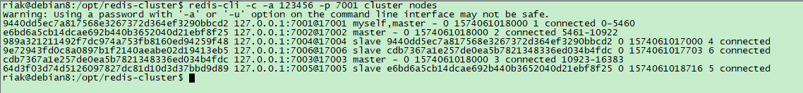

### 测试集群功能

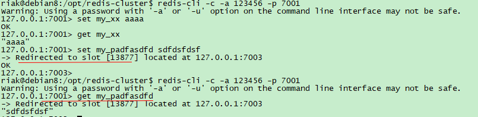

### 查看主从复制是否成功

- 查看从服配置的 appendonly.aof 即可

### 主节点挂掉

- 关闭某个主节点，从节点自动选举为主节点
- 如果主节点，从节点都挂掉了，那么这个集群就无法提供正常的服务了

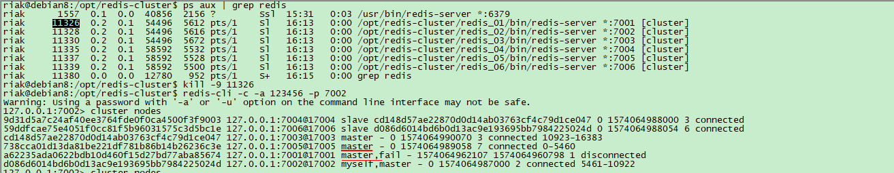

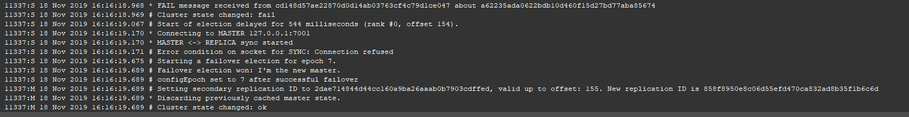

### 重启主节点

- 重启主节点，发现主节点变成了从节点

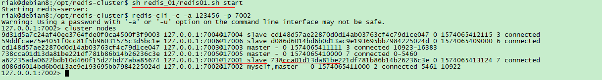

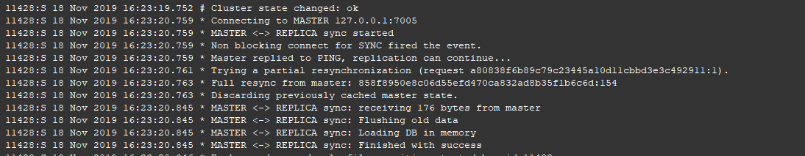

### 集群中加入新节点

- 加入主节点

```
    redis-cli -a 123456 --cluster add-node 127.0.0.1:7007 127.0.0.1:7001
```

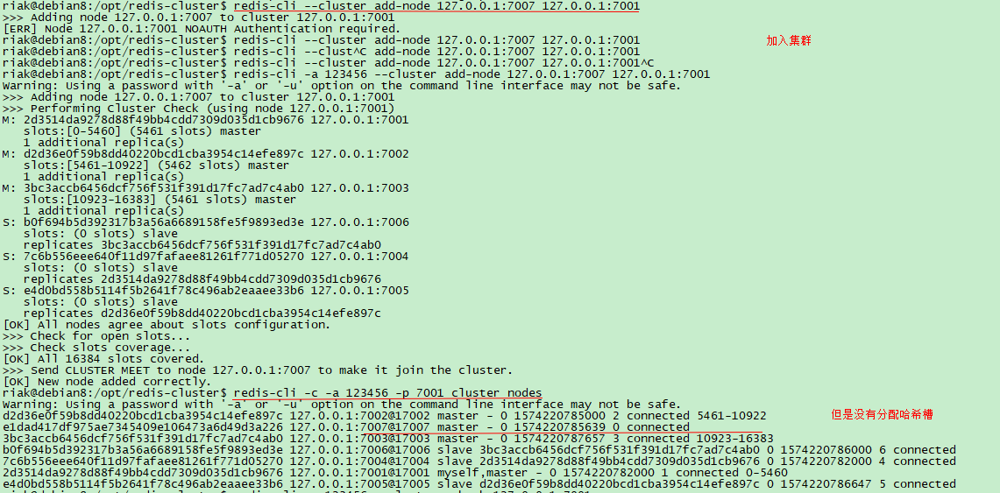

- reshard 过程

```
    redis-cli -a 123456 --cluster reshard 127.0.0.1:7001
    1. How many slots do you want to move (from 1 to 16384)? 4096
    2. What is the receiving node ID? efc3131fbdc6cf929720e0e0f7136cae85657481
       Please enter all the source node IDs.
       Type 'all' to use all the nodes as source nodes for the hash slots.
       Type 'done' once you entered all the source nodes IDs.
       Source node #1: all
    3. Moving slot 1364 from d2237fdcfbba672de766b913d1186cebcb6e1761
       Do you want to proceed with the proposed reshard plan (yes/no)? yes
```

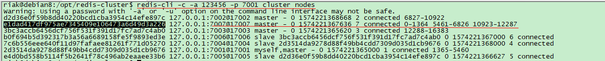

- 加入从节点

```
    redis-cli -a 123456 --cluster add-node --cluster-slave 127.0.0.1:7008 127.0.0.1:7001
```

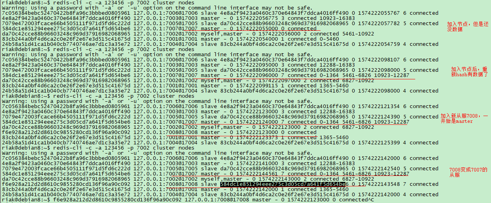

### 移除从节点

```
    redis-cli -a 123456 --cluster del-node 127.0.0.1:7008 '<node-id>'
```

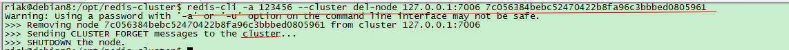

### 移除主节点

```
    redis-cli -a 123456 --cluster del-node 127.0.0.1:7007 `<node-id>`
```

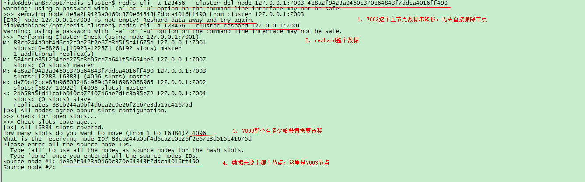

## 参考

- https://www.cnblogs.com/diegodu/p/9183356.html
