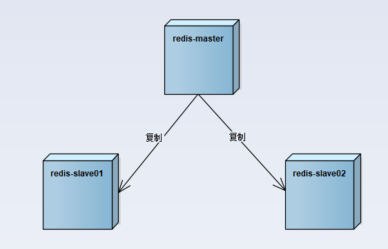
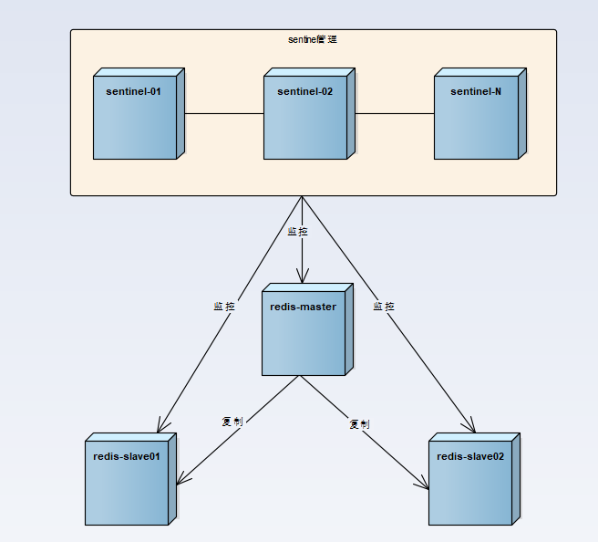

# redis 哨兵模式

## 单点 redis 问题

- 数据备份和数据体量较大造成的性能降低

## 旧的主从模式

- 每个客户端连接 redis 实例的时候都是指定了 ip 和端口号的，如果所连接的 redis 实例因为故障下线了，而主从模式也没有提供一定的手段通知客户端另外可连接的客户端地址，因而需要手动更改客户端配置重新连接
- 主从模式下，如果主节点由于故障下线了，那么从节点因为没有主节点而同步中断，因而需要人工进行故障转移工作

## 哨兵模式

- sentinel 只是在其外部额外添加的一组用于监控作用的 redis 实例
- 在主从节点和 sentinel 节点集合配置好之后，sentinel 节点之间会相互发送消息，以检测其余 sentinel 节点是否正常工作，并且 sentinel 节点也会向主从节点发送消息，以检测监控的主从节点是否正常工作
- 当认为主节点已下线，那么其就会对主节点进行故障转移工作
- 对于从节点下线了，sentinel 是不会对其进行故障转移的，并且连接从节点的客户端也无法获取到新的可用从节点，而这些问题在 Cluster 中都得到了有效的解决

### 故障转移

- 在从节点中选取某个从节点向其发送 slaveof no one（假设选取的从节点为 127.0.0.1:6380），使其称为独立的节点（也就是新的主节点）
- sentinel 向其余的从节点发送 slaveof 127.0.0.1 6380 命令使它们重新成为新的主节点的从节点
- 重新分配之后 sentinel 节点集合还会继续监控已经下线的主节点（假设为 127.0.0.1:6379），如果其重新上线，那么 sentinel 会向其发送 slaveof 命令，使其成为新的主机点的从节点，如此故障转移工作完成

