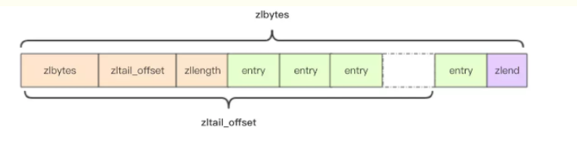
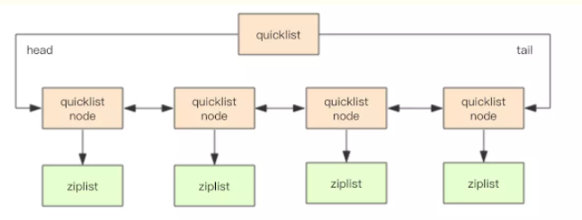

# redis 数据结构之列表

## 介绍

- Redis 列表是简单的字符串列表，按照插入顺序排序。你可以添加一个元素到列表的头部（左边）或者尾部（右边）
- 一个列表最多可以包含 2^32 - 1 个元素
- 当列表弹出了最后一个元素之后，该数据结构自动被删除，内存被回收

## 内部编码

- ziplist（压缩列表）

  - 当哈希类型元素个数小于 hash-max-ziplist-entries 配置（默认 512 个）,同时所有值都小于 hash-max-ziplist-value 配置（默认 64 个字节）时，Redis 会使用 ziplist 作为哈希的内部实现

- linkedlist（链表）
  - 当列表类型无法满足 ziplist 的条件时，Redis 会使用 linkedlist 作为列表的内部实现

### 测试代码

- [参考 hash 的测试](./redis-hash.md)

### list 数据结构

- head 节点的 prev 和 tail 节点的 next 都指向 NULL, 对链表的访问以 NULL 为终点
- length 为链表存储的节点个数, 获取节点数量的复杂度为 0(1)

```
// 链表
struct list {
    listNode *head;
    listNode *tail;
    long length;
}

// 链表的节点
struct listNode<T> {
    listNode* prev;
    listNode* next;
    T value;
}
```

### ziplist 数据结构

- 压缩列表是一块连续的内存空间，元素之间紧挨着存储，没有任何冗余空间
- Redis 为了节约内存空间使用，zset 和 hash 容器对象在元素个数较少的时候，采用压缩列表 (ziplist) 进行存储。
- 3.2.0 版本之前, 当 List 容器对象在元素个数较少的时候，也采用压缩列表 (ziplist) 进行存储, 3.2.0 之后 List 全部使用 quickList(快速列表)
  

```
struct ziplist<T> {
    int32 zlbytes;          // 4 byte, 记录整个压缩列表占用内存字节数,在内存分配或者计算 zlend 的位置时使用
    int32 zltail_offset;    // 4 byte, 最后一个元素距离压缩列表起始位置的偏移量，用于快速定位到最后一个节点
    int16 zllength;         // 2 byte, 元素个数当属性值 < 65535 时, 属性值表示节点个数, 当属性值 = 65535 时, 真实节点个数需要遍历压缩列表才能计算得出
    T[] entries;            // 元素节点列表，节点之间挨个紧凑存储,无冗余空间
    int8 zlend;             // 1 byte,标志压缩列表的结束，值恒为 0xFF
}

struct entry {
    int<var> prevlen;           // 前一个 entry 的字节长度
    int<var> encoding;          // 记录了节点的 content 属性所保存的数据的类型及长度.
    optional byte[] content;    // 保存节点的值, 可以是一个字节数组或者整数.
}
```

### quicklist 数据结构

- 考虑到链表的附加空间相对太高，prev 和 next 指针就要占去 16 个字节 (64bit 系统的指针是 8 个字节)，另外每个节点的内存都是单独分配，会加剧内存的碎片化，影响内存管理效率。
- 后续版本对列表数据结构进行了改造，使用 quicklist 代替了 ziplist 和 linkedlist
- quickList 是 zipList 和 linkedList 的混合体，它将 linkedList 按段切分，每一段使用 zipList 来紧凑存储，多个 zipList 之间使用双向指针串接起来
  

```
// 快速列表
struct quicklist {
    quicklistNode* head;
    quicklistNode* tail;
    long count;             // 元素总数
    int nodes;              // ziplist 节点的个数
    int compressDepth;      // LZF 算法压缩深度
    ...
}
// 快速列表节点
struct quicklistNode {
    quicklistNode* prev;
    quicklistNode* next;
    ziplist* zl;            // 指向压缩列表
    int32 size;             // ziplist 的字节总数
    int16 count;            // ziplist 中的元素数量
    int2 encoding;          // 存储形式 2bit，原生字节数组还是 LZF 压缩存储
    ...
}

struct ziplist_compressed {
    int32 size;
    byte[] compressed_data;
}

struct ziplist {
    ...
}
```

- 压缩深度

  - quicklist 默认的压缩深度是 0，也就是不压缩。压缩的实际深度由配置参数 list-compress-depth 决定。
  - 为了支持快速的 push/pop 操作，quicklist 的首尾两个 ziplist 不压缩，此时深度就是 1。
  - 如果深度为 2，就表示 quicklist 的首尾第一个 ziplist 以及首尾第二个 ziplist 都不压缩

- ziplist 长度
  - quicklist 内部默认单个 ziplist 长度为 8k 字节，超出了这个字节数，就会新起一个 ziplist。
  - ziplist 的长度由配置参数 list-max-ziplist-size 决定
