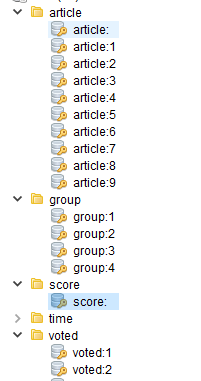

# Redis 使用手册

## 1. 进行缓存前，需要考虑

- 该数据属于短暂保留，例如只保留三天、七天或者一个月，此时建议采用缓存；
- 该数据在某一个时间段请求量很大，此时建议采用缓存；
- 随着用户使用，数据不断变化，更新操作比较频繁，此时建议采用缓存；
- 如果数据量不大，且和应用性能提升不大，数据需要长久保留，此时不建议采用 Redis 进行缓存，
  直接使用 MySQL 等关系型数据库存储即可；
- 如果数据量很大，但是过了一段时间后，该数据几乎没有什么价值，此时建议采用缓存，
  并设定过期时间和定时清理该数据的脚本，这样处理可以减轻存储空间，也便于优化系统的数据库层。

## 2. 进行缓存后，需要考虑

- 缓存该 key 在极端情况下，占用系统内存会有多大？或者说存储的记录大概会达到什么数量级？
- 缓存该 key，过期时间是否方便设置？如果不方便设置，是否可以隔段时间考虑转存到 MySQL 等关系型数据库中，从而清理缓存，释放内存空间。
- 缓存该 key，思考一下手动删除缓存数据的脚本如何编写，缓存的所有数据，如何区分出有价值的数据进行保留，无价值的便利用脚本进行自动化删除。
- 使用缓存后，要思考选择恰当的数据结构来完成代码构建。因为一个适合的数据结构不仅使得代码变得更加优雅，后期维护也很方便。

## 3. 缓存一段时间后，如果发现某一个 key 占用内存很大，超出预料，提供的优化建议：

- 分析该 key 的具体实际功能，和目前的需求，看能否在后续缓存数据时，添加过期时间设定；
- 考虑在取出缓存数据的时候，能否转存到 MySQL 等关系型数据库，如果能够转存成功，
  则在此处可以进行立即执行删除该条缓存数据的方法；后续取数据时，可采用先查询 Redis 数据库，
  未查到再次查询一下 MySQL 等关系型数据库；
- 依据已经缓存的数据，看能够依据数据中的字段或者相关属性对已经缓存的数据进行过滤查询，
  把那些不重要的数据通过脚本进行手动删除处理

## 4. key 设计

- 不要使用过长的 Key，过长会导致不仅会消耗更多的内存，还会导致查找的效率降低
- Key 过短，导致缺失了可读性
- Redis 允许的最大 Key/Value 长度是 512MB
- 建议：最好使用统一的规范来设计 Key，比如”object-type:id:attr”，类型-主键 id-属性的方式命名
- 

## 5. 连接方式

### 直接使用

```
    import redis
    r = redis.Redis(host='192.168.49.130', port=6379)
    r.set('foo', 'Bar')
    print r.get('foo')
```

### 创建连接池

- 使用 connection pool 来管理对一个 redis server 的所有连接
- 避免每次建立、释放连接的开销。
- 默认，每个 Redis 实例都会维护一个自己的连接池
- 可以直接建立一个连接池，然后作为参数 Redis，这样就可以实现多个 Redis 实例共享一个连接池

```
    import redis
    pool = redis.ConnectionPool(host='192.168.49.130', port=6379)
    r = redis.Redis(connection_pool=pool)
    #r = redis.StrictRedis(connection_pool=pool) #StrictRedis也是支持的
    r.set('foo', 'Bar')
    print r.get('foo')
```

### 管道

- redis 客户端执行每次请求都会向连接池申请创建连接，请求完毕断开连接
- redis 是 c/s 模式的 tcp server，使用和 http 类型的请求响应协议。
- 一个 client 可以通过 socket 连接向服务端发起多个请求，每发送一个请求后，
  client 会阻塞并等待 redis 服务端响应，服务端处理完请求后会将结果通过响应报文返回给 client，
  也就是说 client 一次只能发送一个请求
- 客户端要想一次发送多个请求，需要使用 mset、mget 等命令，或者使用管道

```
[root@web redis_py]# cat demon3.py
#!/usr/bin/env python

import redis
import datetime
from demon2 import getConnection

def withpipeline(r):
    p = r.pipeline(transaction=True)
    for i in xrange(1000):
        key = 'test1' + str(i)
        value = i+1
        p.set(key, value)
    p.execute()

def withoutpipeline(r):
    for i in xrange(1000):
        key = 'test2' + str(i)
        value = i+1
        r.set(key, value)

if __name__ == '__main__':
    r = getConnection()
    start = datetime.datetime.now()
    withpipeline(r)
    end = datetime.datetime.now()
    offset = (end-start).microseconds
    print 'With pipeline time: {0}'.format(offset)
    start = datetime.datetime.now()
    withoutpipeline(r)
    end = datetime.datetime.now()
    offset = (end-start).microseconds
    print 'Without pipeline time: {0}'.format(offset)


[root@web redis_py]# python demon3.py
With pipeline time: 16403
Without pipeline time: 43398
```

## 6. redis-py 提供的 2 个 redis 区别

- StrictRedis 用于实现大部分官方的命令，并使用官方的语法和命令(比如,SET 命令对应与 StrictRedis.set 方法)
- Redis 是 StrictRedis 的子类，用于向后兼容旧版本的 redis-py
- 官方推荐使用 StrictRedis 方法
