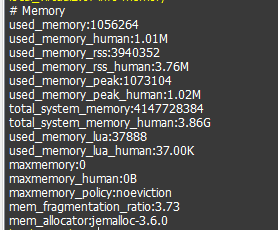

# redis 内存管理

## 1. 内存消耗统计

- used_memory: Redis 分配的内存总量，即存储的所有数据占用的内存
- used_memory_human: 以可读格式返回使用的内存量
- used_memory_rss: 从系统角度,显示 Redis 进程占用的物理内存总量
- used_memory_rss_human: 以可读格式返回 Redis 进程占用的物理内存总量
- used_memory_peak: 内存使用的最大值，表示 used_memory 峰值
- used_memory_peak_human: 以可读格式返回内存使用的最大值
- total_system_memory: 系统总内存
- total_system_memory_human: 以可读格式返回系统总内存
- used_memory_lua: Lua 进程使用内存
- used_memory_lua_human: 以可读格式返回 Lua 进程使用内存
- mem_fragmentation_ratio: 内存碎片率，等价于(used_memory_rss /used_memory)
- mem_allocator: redis 使用的内存分配器

## 2. 碎片率，mem_fragmentation_ratio

- 大于 1：说明内存有碎片，一般在 1 到 1.5 之间是正常的。
- 大于 1.5：说明内存碎片率比较大，需要考虑是否要进行内存碎片清理，要引起重视。
- 小于 1：说明已经开始使用交换内存，也就是使用硬盘了，正常的内存不够用了，需要考虑是否要进行内存的扩容

## 3. 内存消耗划分

- redis 内存 = 自身内存 + 对象内存 + 缓冲内存 + 内存碎片
- 其中 Redis 自身内存消耗的很少，通常 used_memory_rss 在 3MB 左右，used_memory 在 800k 左右

### 3.1 对象内存

- 对象内存是 Redis 中最占内存的一块，存储着用户所有数据
- Redis 所有数据都采用 key-value，每次你创建 key-value，都是创建 2 个对象，即 key 对象和 value 对象，
  即 key 的 size + value 的 size
- Key 对象都是字符串，我们应当避免使用过长的 key
- Value 对象根据使用情况不同占用内存也不尽相同，注意监控

### 3.2 缓冲内存

- 缓冲内存涉及到客户端缓冲区，复制积压缓冲区和 AOF 缓冲区

#### 3.2.1 客户端缓冲区

- 指的是所有连接到 Redis 的服务器 tcp 连接输入输出缓冲，输入缓冲无法控制，最大空间 1G;
- 输出缓冲可通过 client-output-buffer-limit 控制

##### 3.2.1.1 普通客户端

- client-output-buffer-limit normal 0 0 0
- 默认并没有对输出缓冲区做限制
- 如果当有大量的慢连接客户端接入时，这部分消耗就不能忽略了，因为消费的很慢，造成输出缓冲区数据积压。
  所以可以设置 maxclients 做限制

##### 3.2.1.2 从客户端

- client-output-buffer-limit slave 256mb 64mb 60
- 主节点会为每一个从节点单独建立一条连接用于命令复制, 当主节点网络延迟较高或主节点挂载大量的从节点时，
  这部分内存消耗将占用很大一部分
- 建议主节点挂载从节点最好不要超过 2 个
- 表示在复制期间，内存缓存去持续消耗超过 64M，或者一次性超过 256MB，那么停止复制，复制失败

##### 3.2.1.3 订阅客户端

- client-output-buffer-limit pubsub 32mb 8mb 60
- 当生产消息的速度快于消费的速度时，输出缓冲区容易积压消息

#### 3.2.2 复制积压缓冲区

- 一个可重用的固定大小缓冲区
- 用于实现部分复制功能
- 根据 repl-backlog-size 参数控制，默认 1MB
- 对于复制积压缓区，主节点有一个，所有从节点共享这个缓冲区，因此可以设置较大的值，比如 100MB，
  这部分投入是有价值的，可以有效避免全量复制

#### 3.2.3 AOF 缓冲区

- 用于 AOF 重写期间保存最近写入的命令，等待被刷到磁盘

### 3.3 内存碎片

- Redis 默认的内存分配器是 jemalloc
- 内存分配器的作用就是为了更好的管理和重复利用内存,但是当存储的数据长短差异较大的时候
- 以下场景容易出现高内存碎片问题
  - 频繁更新，对已经存在的 key 进行 append setrange 操作
  - 大量过期键删除，键对象过期删除后，释放的空间无法得到拆分利用
- 内存碎片清理
  - 自动清理碎片客户端命令：config set activedefrag yes
  - 更改配置：config rewrite
  - 手动清理：memory purge

## 4. 内存管理

### 4.1 最大内存

- Redis 通过 maxmemory 参数限制最大可用内存
- 用于缓存场景，当超出内存上限 maxmemory 时候使用 LRU 等删除策略释放空间
- 防止所用内存超过服务器物理内存

### 4.2 动态调整内存上限

- config set maxmemory 8GB

### 4.3 内存回收策略

#### 4.3.1 删除策略

- 惰性删除: 当客户端读取带有超时属性的 key 的时候，如果已经超过设置的过期时间，会执行删除操作并返回空
- 定时删除：Redis 内部维护一个定时任务，默认每秒运行 10 次，通过配置 hz 属性控制

#### 4.3.2 内存溢出策略

- 内存使用达到 maxmemory 上限时触发内存溢出的控制策略, 具体策略受 maxmemory-policy 参数控制
- volatile-lru -> 根据 LRU 算法删除设置了超时属性的键，直到腾出足够空间为止
- allkeys-lru -> 根据 LRU 算法删除键，不管有没有设置超时属性，在移除最近最少使用的 key (最常用)
- volatile-random -> 随机删除过期键，直到腾出足够空间为止
- allkeys-random -> 随机删除所有键，直到腾出足够空间为止 (几乎不适用)
- volatile-ttl -> 根据 ttl 属性，删除最近将要过期的数据，如果没有回退到 noeviction 策略
- noeviction -> 不会删除任何数据，拒绝所有写入操作，并返回错误信息，此时只是响应读 (几乎不适用)
