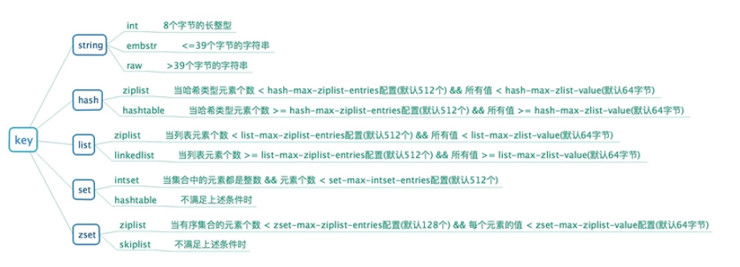

# redis 内存优化

## 1. redisobject 对象


### type 字段

- 表示当前对象使用的数据类型，Redis 主要支持 5 种数据类型:string,hash,list,set,zset
- 可以使用 type {key}命令查看对象所属类型，type 命令返回的是值对象类型，键都是 string 类型

### encoding 字段

- 表示 Redis 内部编码类型，encoding 在 Redis 内部使用，代表当前对象内部采用哪种数据结构实现

### lru 字段

- 记录对象最后一次被访问的时间
- 当配置了 maxmemory 和 maxmemory-policy=volatile-lru | allkeys-lru 时，用于辅助 LRU 算法删除键数据

### refcount 字段

- 记录当前对象被引用的次数，用于通过引用次数回收内存
- 当 refcount=0 时，可以安全回收当前对象空间

### \*ptr 字段

- 与对象的数据内容相关，如果是整数直接存储数据，否则表示指向数据的指针
- Redis 在 3.0 之后对值对象是字符串且长度<=39 字节的数据，内部编码为 embstr 类型，字符串 sds 和 redisObject 一起分配，从而只要一次内存操作
- 高并发写入场景中，在条件允许的情况下建议字符串长度控制在 39 字节以内，减少创建 redisObject 内存分配次数从而提高性能

## 2. 缩减键值对象

### key 长度

- 如在设计键时，在完整描述业务情况下，键值越短越好

### value 长度：值对象缩减比较复杂，常见需求是把业务对象序列化成二进制数组放入 Redis

- 首先应该在业务上精简业务对象，去掉不必要的属性避免存储无效数据
- 其次在序列化工具选择上，应该选择更高效的序列化工具来降低字节数组大小(如 protocol buf)
- 使用通用格式存储数据, 比如:json，xml 等作为字符串存储在 Redis 中，方便调试和跨语言，
  但是同样的数据相比字节数组所需的空间更大，在内存紧张的情况下，可以使用高效压缩算法(google Snappy)

## 3. 共享对象池

### 对象共享池指 Redis 内部维护 0-9999 的整数对象池

```
    local_virtual2:0>select 0
    OK

    local_virtual2:0>set a 1
    OK

    local_virtual2:0>object refcount a
    2

    local_virtual2:0>set b 1
    OK

    local_virtual2:0>object refcount a
    3
```

### 4. 为什么只有整数对象池？

- 首先整数对象池复用的几率最大，其次对象共享的一个关键操作就是判断相等性
- Redis 之所以只有整数对象池，是因为整数比较算法时间复杂度为 O(1)，只保留一万个整数为了防止对象池浪费。
- 如果是字符串判断相等性，时间复杂度变为 O(n)，特别是长字符串更消耗性能(浮点数在 Redis 内部使用字符串存储)。
- 对于更复杂的数据结构如 hash,list 等，相等性判断需要 O(n2)。
- 对于单线程的 Redis 来说，这样的开销显然不合理，因此 Redis 只保留整数共享对象池
- 使用共享对象池后，相同的数据内存使用降低 30%以上

## 5. 字符串优化


### 特点

- O(1)时间复杂度获取：字符串长度，已用长度，未用长度。
- 可用于保存字节数组，支持安全的二进制数据存储。
- 内部实现空间预分配机制，降低内存再分配次数。
- 惰性删除机制，字符串缩减后的空间不释放，作为预分配空间保留

### 预分配

- 防止修改操作需要不断重分配内存和字节数据拷贝，但同样也会造成内存的浪费
- 第一次创建 len 属性等于数据实际大小，free 等于 0，不做预分配。
- 修改后如果已有 free 空间不够且数据小于 1M，每次预分配一倍容量。
- 如原有 len=60byte，free=0，再追加 60byte，预分配 120byte，总占用空间:60byte + 60byte + 120byte + 1byte。
- 修改后如果已有 free 空间不够且数据大于 1MB，每次预分配 1MB 数据。
- 如原有 len=2MB，free=0，当再追加 100byte ,预分配 1MB，总占用空间:2M + 100byte + 1M + 1byte
- 尽量减少字符串频繁修改操作, 如 append，setrange, 改为直接使用 set 修改字符串，降低预分配带来的内存浪费和内存碎片化

- 字符串重构
- 按功能，将相同功能的字符串类型转为 hash 存储
- 记得调整 hash-max-ziplist-value 的值，大于 hash 里任一个 value 的长度即可

### 编码优化

- 所谓编码就是具体使用哪种底层数据结构来实现
- 编码不同将直接影响数据的内存占用和读写效率
- 使用 object encoding {key}命令获取编码类型

## 6. redis 常用数据结构对应使用的编码



#### string 类型

- redis 最基础的数据结构，可以是简单的字符串，复杂的字符串(JSON、XML)，数字，二进制(图片、音频、视频)
- 最大值不能超过 512M

#### hash 类型

- 在数据量较小时使用 ziplist，更加紧凑的存储元素，节省内存；
- 当不满足其使用条件时，会使用 hashtable 作为 hash 的内部实现，
  此时 ziplist 的读写效率会下降，而 hashtable 的读写时间复杂度为 O(1)。

#### list 类型

- 用来存储多个有序的可重复的字符串，一个列表最多可有 2^32-1 个元素；
- 可以对列表两端插入和弹出，还可以取指定范围的元素列表、获取指定索引下标的元素等。
- 列表是一种比较灵活的数据结构，可以充当栈和队列的角色。

#### set 类型

- 集合中不允许有重复元素，并且集合中的元素是无序的。
- 一个 set 集合最多可有 2^32-1 个元素，支持多个集合的交集、并集、差集。

#### zset 类型

- 有序集合，不能有重复元素，但元素可以排序，通过给每一个元素设置一个分数作为排序的依据。
- 提供了获取指定分数和元素范围查询、计算成员排名等功能

## 7. Redis 为什么需要对一种数据结构实现多种编码方式？

- 主要原因是 Redis 作者想通过不同编码实现效率和空间的平衡。
- 比如当我们的存储只有 10 个元素的列表，当使用双向链表数据结构时，必然需要维护大量的内部字段如每个元素需要:
  前置指针，后置指针，数据指针等，造成空间浪费，
- 如果采用连续内存结构的压缩列表(ziplist)，将会节省大量内存，而由于数据长度较小，存取操作时间复杂度即使为 O(n2)性能也可满足需求

## 8. 控制编码类型

- 编码类型转换在 Redis 写入数据时自动完成，这个转换过程是不可逆的，转换规则只能从小内存编码向大内存编码转换
- Redis 之所以不支持编码回退，主要是数据增删频繁时，数据向压缩编码转换非常消耗 CPU，得不偿失

## 9. ziplist

- ziplist 编码主要目的是为了节约内存，因此所有数据都是采用线性连续的内存结构
- ziplist 编码是应用范围最广的一种，可以分别作为 hash、list、zset 类型的底层数据结构实现
- 使用 ziplist 压缩编码的原则：追求空间和时间的平衡

### 结构


- zlbytes: 记录整个压缩列表所占字节长度，方便重新调整 ziplist 空间。类型是 int-32，长度为 4 字节
- zltail: 记录距离尾节点的偏移量，方便尾节点弹出操作。类型是 int-32，长度为 4 字节
- zllen: 记录压缩链表节点数量，当长度超过 216-2 时需要遍历整个列表获取长度，一般很少见。类型是 int-16，长度为 2 字节
- entry: 记录具体的节点，长度根据实际存储的数据而定。
  - prev_entry_bytes_length: 记录前一个节点所占空间，用于快速定位上一个节点，可实现列表反向迭代。
  - encoding: 标示当前节点编码和长度，前两位表示编码类型：字符串/整数，其余位表示数据长度。
  - contents: 保存节点的值，针对实际数据长度做内存占用优化。
  - zlend: 记录列表结尾，占用一个字节

### 特点

- 内部表现为数据紧凑排列的一块连续内存数组。
- 可以模拟双向链表结构，以 O(1)时间复杂度入队和出队。
- 新增删除操作涉及内存重新分配或释放，加大了操作的复杂性。
- 读写操作涉及复杂的指针移动，最坏时间复杂度为 O(n2)。
- 适合存储小对象和长度有限的数据

### 建议

- 针对性能要求较高的场景使用 ziplist，建议长度不要超过 1000，每个元素大小控制在 512 字节以内。
- 命令平均耗时使用 info Commandstats 命令获取，包含每个命令调用次数，总耗时，平均耗时，单位微秒。

## 10. intset

- intset 编码是集合(set)类型编码的一种，内部表现为存储有序，不重复的整数集。
- 当集合只包含整数且长度不超过 set-max-intset-entries 配置时被启用

### 结构


- encoding:整数表示类型，根据集合内最长整数值确定类型，整数类型划分三种:int-16，int-32，int-64。
- length:表示集合元素个数。
- contents:整数数组，按从小到大顺序保存。

### 建议

- intset 保存的整数类型根据长度划分，当保存的整数超出当前类型时，将会触发自动升级操作且升级后不再做回退。
- 升级操作将会导致重新申请内存空间，把原有数据按转换类型后拷贝到新数组
- 使用 intset 编码的集合时，尽量保持整数范围一致，如都在 int-16 范围内。防止个别大整数触发集合升级操作，产生内存浪费
