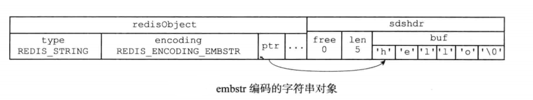

# 对象

## 介绍

- 我们可以针对不同的使用场景，为对象设置不同多种不同的数据结构来实现，从而优化对象在不同场景的使用效率
- 实现了基于引用计数技术的内存回收机制，当程序不再使用某个对象的时候，这个对象占用的内存就会被自动释放
- 使用引用计数技术来实现对象共享机制，通过让多个数据库键共享同一个对象来节约内存

## 数据结构

```
typedef struct redisObject {
    unsigned type:4;
    unsigned encoding:4;
    unsigned lru:LRU_BITS; /* LRU time (relative to global lru_clock) or
                            * LFU data (least significant 8 bits frequency
                            * and most significant 16 bits access time). */
    int refcount;
    void *ptr;
} robj;
```

- type: 类型
- encoding: 记录了这个对象使用了什么数据结构作为对象的底层实现

## 字符串对象

- 如果字符串对象保存的是整数值，并且这个整数值可以用 long 类型来表示，那么字符串对象编码为 int
- 如果字符串对象保存的是一个字符串，并且字符串的长度大于 32 字节，那么字符串对象编码为 raw
- 如果字符串对象保存的是一个字符串，并且字符串的长度小于 32 字节，那么字符串对象编码为 embstr
- 
