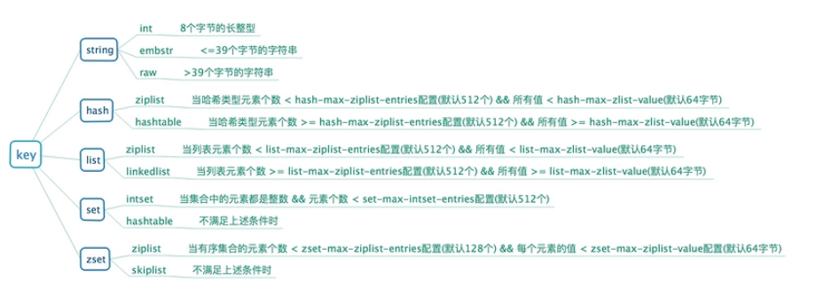

## 介绍

- redis 是一个 key-value 存储系统
- 它支持存储的 value 类型相对更多，包括 string(字符串)、list(链表)、set(集合)、zset(sorted set --有序集合)和 hash（哈希类型）。
- 这些数据类型都支持 push/pop、add/remove 及取交集并集和差集及更丰富的操作，而且这些操作都是原子性的。
- 在此基础上，redis 支持各种不同方式的排序。与 memcached 一样，为了保证效率，数据都是缓存在内存中。

## 特点

- 以字典结构存储数据
- 允许通过 TCP 协议读取字典的内容
- 强大的缓存系统, 可以为每个键设置 TTL, 以及按照一定规则自动淘汰不需要的键
- 支持使用列表的形式构造任务队列
- 数据存储在内存中也可以持久化到硬盘

## 安装

- [redis 安装](./install.md)

## 使用手册

- [redis 使用手册](./manual.md)

## 常用指令

- [redis 常用指令](./command.md)

## 数据结构

- 
- [redis 字符串](./data-structure/redis-string.md)
- [redis 哈希](./data-structure/redis-hash.md)
- [redis 列表](./data-structure/redis-list.md)
- [redis 集合](./data-structure/redis-set.md)
- [redis 有序集合](./data-structure/redis-sortedset.md)

## 内存管理与优化

- [redis 内存管理](./memory/mem-mgr.md)
- [redis 内存优化](./memory/mem-opt.md)

## 对象

- [redis 对象](./object.md)

## 持久化方式

- [redis 持久化机制之 AOF](./save/AOF.md)
- [redis 持久化机制之 RDB](./save/RDB.md)
- [redis 持久化建议](./save/save-advice.md)

## 集群

- [redis 主从复制](./cluster/master-slave.md)
- [redis 哨兵模式](./cluster/sentinel.md)
- [redis 集群](./cluster/redis-cluster.md)
