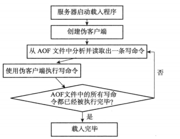
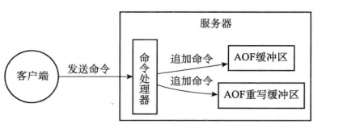

# 数据持久化之 AOF

## 1. 介绍

- 通过保存 Redis 服务器执行的写命令来记录数据库状态的

## 2. AOF 持久化的实现

### 命令追加

- 服务器执行一个写命令后，会以协议格式将被执行的写命令追加到服务器状态的 aof_buf 缓冲区的末尾

### AOF 文件的写入与同步

- 服务器在处理文件事件时可能会执行写命令，使得一些内容被追加到 aof_buf 缓存区里面
- 服务器每次结束一个事件循环之前，它都会调用 flushAppendOnlyFile 函数，
  考虑是否将 aof_buf 缓冲区中的内容写入和保存到 AOF 文件里面
- flushAppendOnlyFile 函数由配置 appendfsync 选项的值来决定
  - always: 命令写入 aof_buf 后立即调用系统 fsync 操作同步到 AOF 文件，fsync 完成后线程返回。
    这种情况下，每次有写命令都要同步到 AOF 文件，硬盘 IO 成为性能瓶颈，Redis 只能支持大约几百 TPS 写入，严重降低了 Redis 的性能；
    即便是使用固态硬盘（SSD），每秒大约也只能处理几万个命令，而且会大大降低 SSD 的寿命
  - everysec: 命令写入 aof_buf 后调用系统 write 操作，write 完成后线程返回，
    fsync 同步文件操作由专门的线程每秒调用一次
  - no: 命令写入 aof_buf 后调用系统 write 操作，不对 AOF 文件做 fsync 同步，
    同步由操作系统负责，通常同步周期为 30 秒，
    这种情况下，文件同步的时间不可控，且缓冲区中堆积的数据会很多，数据安全性无法保证

## 3. AOF 文件的载入



## 4. AOF 重写的问题

### 背景

- AOF 持久化是通过保存被执行的写命令来记录数据库状态的
- 随着服务器运行，文件的体积会变大，使用 AOF 进行还原所需的时间变久
- 举例，存在一个 key 的写操作的记录有多次的情况

### 重写的条件

- AOF 重写可以由用户通过调用 BGREWRITEAOF 手动触发
- 没有 BGSAVE 命令（RDB 持久化）/AOF 持久化在执行
- 没有 BGREWRITEAOF 在进行
- aof_current_size > auto-aof-rewrite-min-size
- aof_current_size / aof_rewrite_base_size >= auto-aof-rewrite-percentage

### 重写的原理：

```
redis> RPUSH list 'A' 'B'       //['A', 'B']
redis> RPUSH list 'C'           //['A', 'B', 'C']
redis> RPUSH list 'D' 'E'       //['A', 'B', 'C', 'D', 'E']
redis> LPOP list                //['B', 'C', 'D', 'E']
redis> LPOP list                //['C', 'D', 'E']
redis> RPUSH list 'F' 'G'       //['C', 'D', 'E', 'F', 'G']
```

- 服务器为了保存 list 键的状态，必须在 AOF 文件中写入六条命令
- 为了尽量用最少的命令来记录 list 键的状态，最简单有效的办法不是分析现有 AOF 文件，
  而是直接读取数据，用一条 RPUSH list "C" "D" "E" "F" "G"命令来代替保存在 AOF 文件中的六条命令

### 后台重写

- aof_rewrite 这个函数可以很好地完成创建一个新 AOF 文件的任务，但是会进行大量的写入操作，不适合主线程调用
- 采用进程的方式，子进程进行 AOF 重写期间，服务器进程可以继续处理命令请求
- 子进程带有父进程的数据副本，使用进程而不是线程，避免使用锁的情况下，保证数据的安全性
- 问题是，在重写期间，父进程仍在处理命令请求，导致数据不一致
  

## 5. AOF 配置

### appendonly no

- 是否开启 AOF

### appendfilename "appendonly.aof"

- AOF 文件名

### dir ./

- RDB 文件和 AOF 文件所在目录

### appendfsync everysec

- fsync 持久化策略

### no-appendfsync-on-rewrite no

- AOF 重写期间是否禁止 fsync
- 如果开启该选项，可以减轻文件重写时 CPU 和硬盘的负载（尤其是硬盘）
- 但是可能会丢失 AOF 重写期间的数据
- 需要在负载和安全性之间进行平衡

### auto-aof-rewrite-percentage 100

- 文件重写触发条件之一

### auto-aof-rewrite-min-size 64mb

- 文件重写触发提交之一, 只要硬盘许可，增加该值，从而尽量减少 AOF rewrite 的频率

### aof-load-truncated yes

- 如果 AOF 文件结尾损坏，Redis 启动时是否仍载入 AOF 文件

## 6. 关闭 AOF

### 方法 1，修改配置，重启 redis

- appendfsync no

### 方法 2，执行客户端命令

- config set appendfsync no

## 7. 关闭 AOF 自动重写

### 方法 1，修改配置，重启 redis

- auto-aof-rewrite-percentage 0

### 方法 2，执行客户端命令

- config set auto-aof-rewrite-percentage 0
