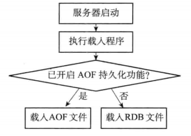
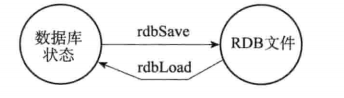
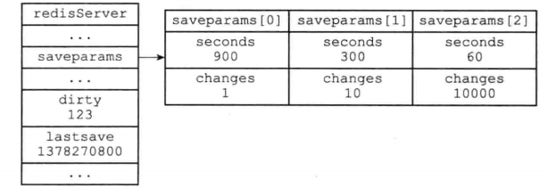
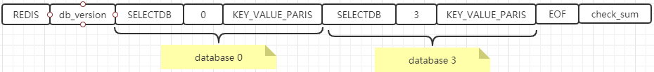
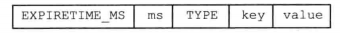
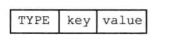

# 数据持久化之 RDB

## 1. RDB 持久化

- RDB 代表了某一个时刻的 Redis 完整的数据快照;
- RDB 持久化功能所生成的 RDB 文件是一个经过压缩的二进制文件
- 通过该文件可以还原生成 RDB 文件时的数据库状态

## 2. 创建 RDB 的方式

- SAVE 命令：会直接阻塞服务器进程，直到 RDB 文件创建完毕为止，在服务器进程阻塞期间，服务器不能处理任何命令请求
- BGSAVE 命令：会派生出一个子进程，然后由子进程负责创建 RDB 文件，而服务器进程继续处理命令请求
- 源代码: rdb.c/rdbSave 函数

## 3. RDB 的载入方式

- RDB 文件的载入工作是在服务器启动时自动执行的
- 查看 redis 日志："DB loaded from disk: 0.018 seconds"，代表着服务器成功载入 RDB
- 如果服务器开启了 AOF 持久化功能，服务器会优先使用 AOF 来还原数据库状态，其次使用 RDB
- 源代码：rdb.c/rdbLoad 函数
- 载入磁盘文件的时候判断
  
- 创建和载入 RDB 文件
  

## 4. BGSAVE 执行时服务器状态

### BGSAVE 与 SAVE

- BGSAVE 执行时候，客户端发送的 SAVE 或 BGSAVE 会被服务器拒绝
- 不能同时执行是为了避免父进程和子进程同时执行 2 个 rdbSave 调用，防止产生竞争条件

### BGSAVE 和 BGREWRITEAOF

- BGSAVE 命令正在运行中，客户端发送的 BGREWRITEAOF 命令会延迟到 BGSAVE 执行完毕后执行
- BGREWRITEAOF 命令正在执行中，客户端发送的 BGSAVE 会被拒绝
- 不能同时进行的原因是：虽然都是子进程在执行，但是同时执行会产生大量的磁盘写入操作，处于性能的考虑

### BGSAVE 执行的原理

- Redis 在持久化时会 fork 产生一个子进程，快照持久化完全交给子进程来处理，父进程继续处理客户端请求。
- 子进程刚刚产生时，它和父进程共享内存里面的代码段和数据段。这是 Linux 操作系统的机制，
  为了节约内存资源，所以尽可能让它们共享起来，在进程分离的一瞬间，内存的增长几乎没有明显变化。
- 子进程做数据持久化，它不会修改现有的内存数据结构，它只是对数据结构进行遍历读取，
  然后序列化写到磁盘中。但是父进程不一样，它必须持续服务客户端请求，然后对内存数据结构
  进行不间断的修改。
- 这个时候就会使用操作系统的 COW 机制来进行数据段页面的分离。数据段是由很多操作系统的页面组合而成，
  当父进程对其中一个页面的数据进行修改时，会将被共享的页面复制一份分离出来，然后对这个
  复制的页面进行修改。这时子进程相应的页面是没有变化的，还是进程产生时那一瞬间的数据

### 执行过程

- Redis 父进程首先判断当前是否在执行 save，bgsave，bgrewriteaof 的子进程，如果存在直接返回
- 父进程执行 fork 操作创建子进程，这个过程中父进程是阻塞的，Redis 不能执行来自客户端的任何命令
- 父进程 fork 后，bgsave 命令返回”Background saving started”信息并不再阻塞父进程，并可以响应其他命令
- 子进程创建 RDB 文件，根据父进程内存快照生成临时快照文件，完成后对原有文件进行原子替换
- 子进程发送信号给父进程表示完成，父进程更新统计信息

## 5. 自动间隔性保存

### 条件

- save 900 1: 服务器在 900s 之内，对数据库进行了至少 1 次修改
- save 300 10: 服务器在 300s 之内，对数据库进行了至少 10 次修改
- save 60 10000: 服务器在 60s 之内，对数据库进行了至少 10000 次修改

### 参数

- saveparams 数组: 保存 save 选项所设置的的保存条件
- dirty 计数器: 记录距离上一次成功执行 SAVE 或 BGSAVE 命令之后，服务器对数据库状态进行了
  多少次修改(写入，删除，更新等操作)，而不是客户端执行了多少条命令，
  如执行了 sadd myset v1 v2 v3，则 dirty 值会+3
- lastsave 属性：记录了服务器上一次执行 SAVE 或 BGSAVE 命令的时间
- serverCron 周期性函数: 默认每隔 100 毫秒就会执行一次，该函数用于对正在进行的服务器进行维护，
  它的其中一项工作就是检查 save 选项所设置的保存条件是否满足，如果满足的话，就执行 BGSAVE 命令

### 其他触发条件

- 在主从复制场景下，如果从节点执行全量复制操作，则主节点会执行 bgsave 命令，并将 rdb 文件发送给从节点
- 执行 shutdown 命令时，自动执行 rdb 持久化

## 6. RDB 的文件结构

### 介绍

- 最开头的部分是 REDIS，5 个字节，方便快速检查是否为 RDB 文件
- db_version: RDB 文件的版本号，4 个字节
- EOF: 标志着 RDB 文件正文的结束，1 个字节
- check_sum: 校验和，对 REDIS，db_version，databases，EOF 四个部分的内容进行计算得出的

### databases

- selectdb: 表示接下来要读入的将是一个数据库号码，1 个字节
- db_number: 数据库号码，当程序读入 db_number 后，会进行 select 命令切换数据库
- key_value_pairs: 包括 key、value 值，及其数据类型、内部编码、过期时间、压缩信息
- 带过期时间的 key: 
- 不带过期时间的 key: 

## 7. RDB 配置

### save m n

- bgsave 自动触发的条件
- 如果没有 save m n 配置，相当于自动的 RDB 持久化关闭

### stop-writes-on-bgsave-error yes

- 当 bgsave 出现错误时，Redis 是否停止执行写命令
- 设置为 yes，则当硬盘出现问题时，可以及时发现，避免数据的大量丢失
- 设置为 no，则 Redis 无视 bgsave 的错误继续执行写命令，当对 Redis 服务器的系统(尤其是硬盘)使用了监控时，该选项考虑设置为 no

### rdbcompression yes

- 是否开启 RDB 文件压缩，默认采用 LZF 算法对 RDB 文件进行压缩

### rdbchecksum yes

- 是否开启 RDB 文件的校验，在写入文件和读取文件时都起作用
- 关闭 checksum 在写入文件和启动文件时大约能带来 10%的性能提升，但是数据损坏时无法发现

### dbfilename dump.rdb

- RDB 文件名

### dir ./

- RDB 文件和 AOF 文件所在目录

## 8. 关闭 RDB

### 方法 1，修改配置，注释下面三行，重启 redis

- save 900 1
- save 300 10
- save 60 10000

### 方法 2，执行客户端命令

- config set save ""
